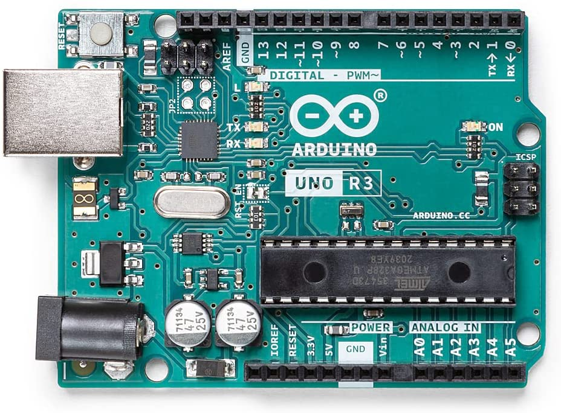
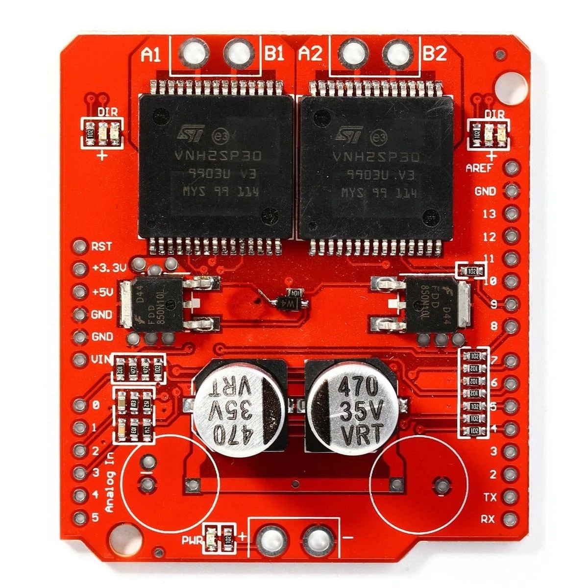
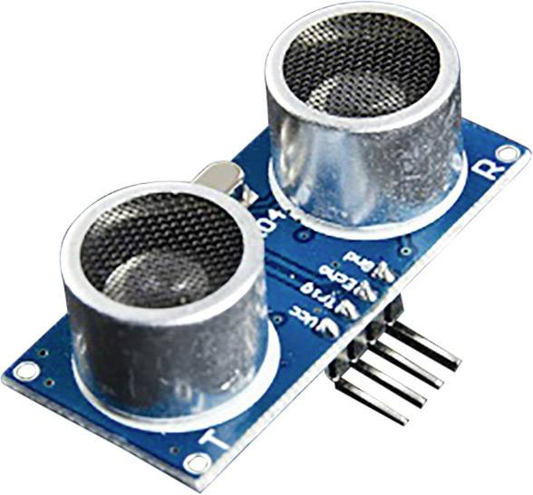
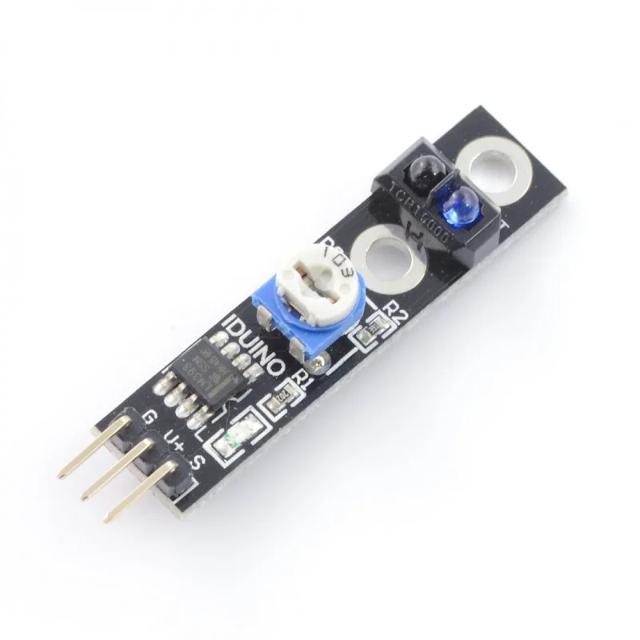

---

# Linerover

Hey! Welcome to the official repository of my **Autonomous Car** called Linerover. During my first year of computer
science, I worked on the Linerover, and it was the final product for the Project System module at Saxion University.


&nbsp;

### 💻 Software

I wrote this project in C++ using the Arduino framework, which I learned by following multiple classes at my university
and doing a lot of research online. By combining a very intelligent IDE like Clion by Jetbrains, and Platformio, I was
able to write and test my code very efficiently.

#### Arduino Startup

```c++
#include "Linerover.h"

bool RUNNING = false;
bool LOGGING = false;

void setup() {
    // Configure the linerover logger
    if (LOGGING) Logger::configure(Pins::SERIAL_BAUD);

    // Linerover#startEngine() is used to enable the car, initialize all the controllers,
    // and make sure everything is ready before driving/looping
    Linerover::startEngine();

    // Set the global boolean variable to true for the loop function to start working
    RUNNING = true;
}

void loop() {
    // Having a while loop will give us the ability to stop looping
    // whenever we want, without killing/stopping the entire program.
    while (RUNNING) {
        if (!(RUNNING = Linerover::drive())) break;
    }
}
```

 &emsp;  &emsp;  

&nbsp;

### 🔧 Hardware

The hardware for the Linerover was partly delivered to us, however, we were free to choose what kind of sensors we
wanted to use.

##### Component List

- Arduino UNO
- Ishima - RC 390 motor _(ISH-010-021)_
- Ishima - 3-wire Steering Servo _(ISH-010-056)_
- Ishima - Li-ion Battery 7.4V, 2400mAh _(ISH-010-020)_
- VNH2SP30 _(Motor Shield)_
- 1x Iduino ST1099 Ultrasonic sensor _(Echo Sensor)_
- 5x ST1140  _(Infrared Sensor)_
- DC/DC Buck Converter

 &emsp;  &emsp;  &emsp; 